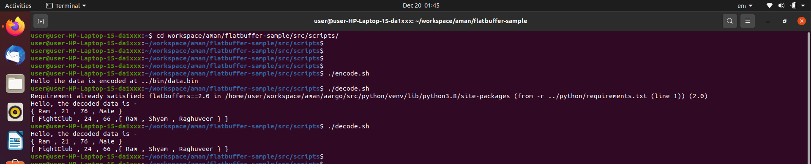

# flatbuffer-sample

###### author @amansaha, date @20/12/2021

## Features

- OS - Ubuntu 20.04.03 LTS
- Programming Language - C++, Python, Bash

## Installation / Usage

```
git clone https://github.com/aman-saha/flatbuffer-sample.git
cd flatbuffer-sample/src/scripts/
chmod +x *.sh
./encode.sh # encodes the data
./decode.sh # decodes the data
```

## Output




